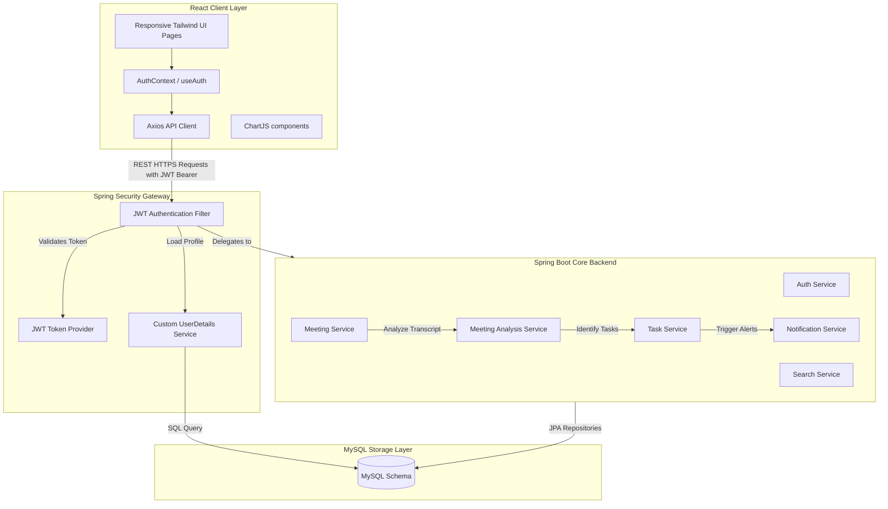

# MeetingFlow - System Architecture

MeetingFlow is built using a clean, modern three-tier web architecture designed for scalability, security, and responsive performance.

## Architectural Diagram

## Module Boundaries

1. **Client Tier**:
   - Built on **React (Vite)** utilizing **Tailwind CSS** for responsive styling.
   - Global auth states are shared via `AuthContext` with automatic Bearer token attachments via Axios interceptors.
   - Dashboard statistics render dynamically via **Chart.js**.

2. **Security Gateway**:
   - Integrates stateless **Spring Security** utilizing **JWT tokens**.
   - Filters check incoming request headers for `Authorization: Bearer <JWT>` and loads context.

3. **Core Services Layer**:
   - Follows SOLID design principles.
   - **Meeting Service** coordinates uploads and feeds transcripts to the NLP analyzer.
   - **Meeting Analysis Service** parses the transcript lines looking for keywords ("should", "assigned to", "decided") to automatically spin up summary segments and action-to-task translations.

4. **Persistence Tier**:
   - Uses a fully normalized **MySQL** schema.
   - Handled via **Spring Data JPA** with Hibernate mapping.
